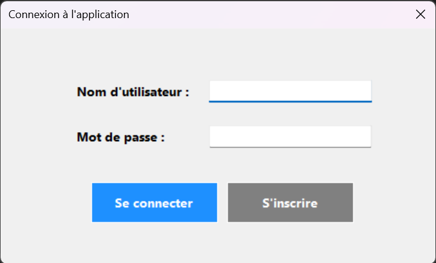
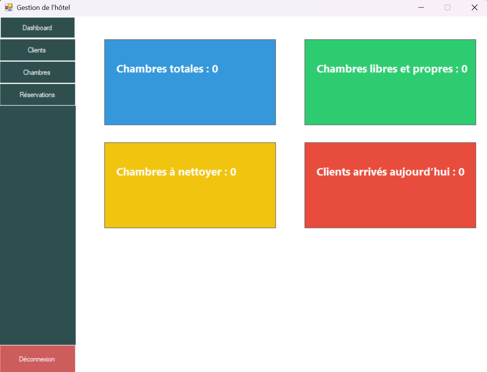
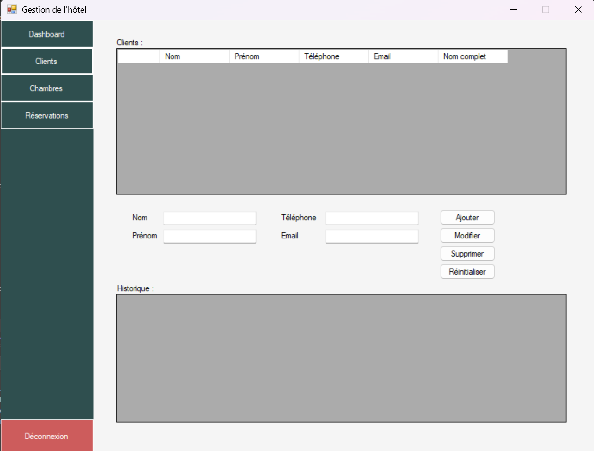
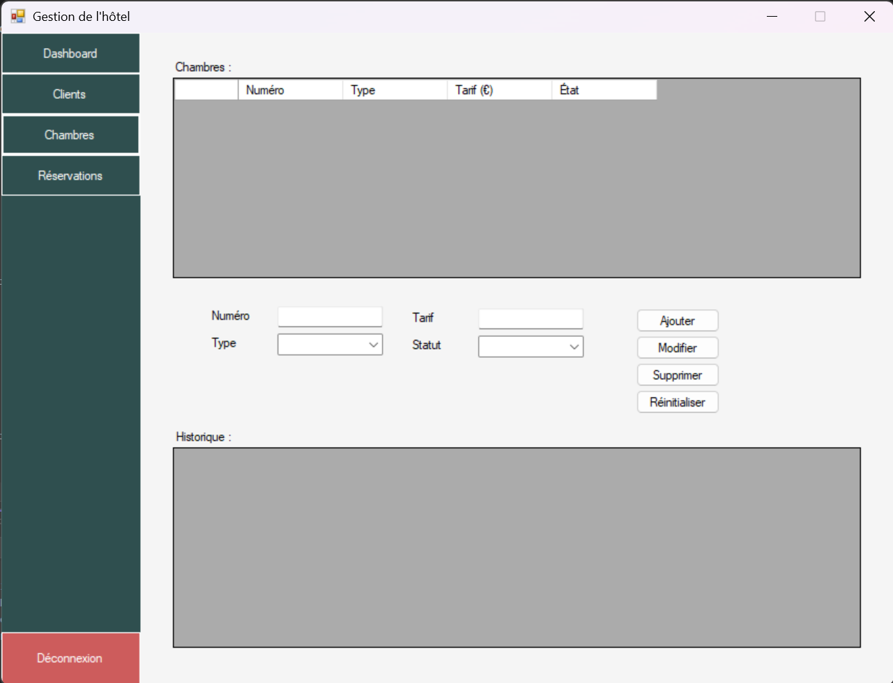
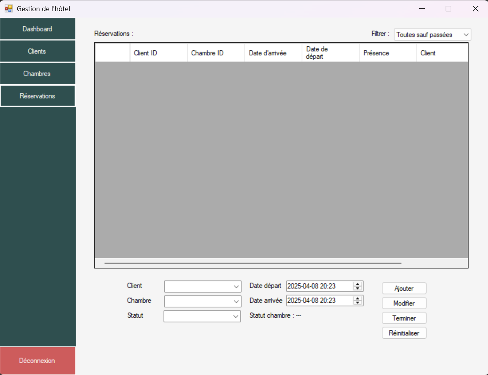
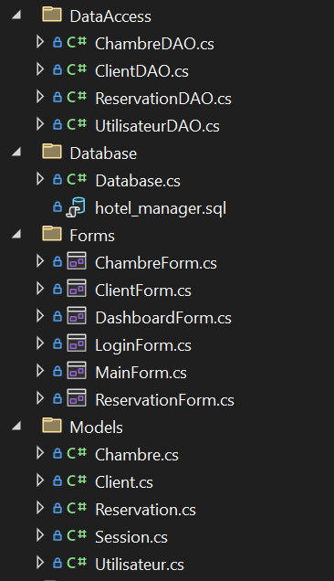
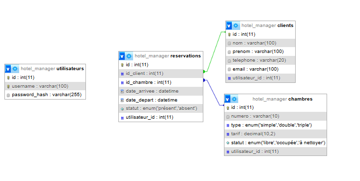
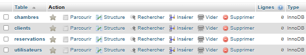

# Hotel_Manager

**HotelManager** est une application de bureau complète développée en **C# (.NET WinForms)**, conçue pour assurer une **gestion efficace et intuitive d’un établissement hôtelier**.

Elle permet aux utilisateurs de gérer de manière centralisée :
- les **chambres** (disponibilité, statut, tarifs),
- les **clients** (fiche, historique, suivi),
- les **réservations** (création, modification, présence),
- et un **tableau de bord synthétique** affichant en temps réel les indicateurs clés de l’hôtel.

Le projet repose sur une architecture claire avec séparation des responsabilités (DAO, modèles, vues), une base de données relationnelle optimisée (MySQL), et un système d’authentification sécurisé par hachage de mots de passe.

> ⚡ **HotelManager est un projet open-source, librement réutilisable, modifiable et exploitable** à des fins pédagogiques, personnelles ou professionnelles, sans aucune restriction.

---

## Aperçu de l'application

| Authentification | Dashboard |
|------------------|-----------|
|  |  |

| Clients | Chambres |
|---------|----------|
|  |  |

| Réservations |
|--------------|
|  |

---

## Fonctionnalités

- Authentification utilisateur (inscription / connexion)
- Dashboard avec indicateurs clés (chambres libres, à nettoyer, clients arrivés)
- Gestion des clients (ajout, modification, suppression, historique)
- Gestion des chambres (numéro, type, tarif, statut)
- Gestion des réservations (création, édition, statut, filtre)
- Suivi de l'état des chambres (à nettoyer, propres, occupées)
- Historique associé pour chaque client et chaque chambre

---

## Installation

1. **Cloner le dépôt :**

```bash
git clone https://github.com/yhn-dm/hotel_manager.git
```
### Ouvrir le projet dans Visual Studio

1. Cloner ce dépôt ou télécharger le projet.
2. Ouvrir le fichier `.sln` avec **Visual Studio**.

---

### Configurer la base de données MySQL avec XAMPP

1. Démarrer **Apache** et **MySQL** via le panneau de contrôle XAMPP.

   

2. Accéder à **phpMyAdmin** : http://localhost/phpmyadmin  
3. Importer la base de données ou bien le script SQL directement pour créer la base de données :

```sql
CREATE DATABASE IF NOT EXISTS hotel_manager DEFAULT CHARACTER SET utf8mb4 COLLATE utf8mb4_unicode_ci;
USE hotel_manager;

-- Table des utilisateurs
CREATE TABLE utilisateurs (
    id INT AUTO_INCREMENT PRIMARY KEY,
    username VARCHAR(255) NOT NULL UNIQUE,
    password_hash VARCHAR(255) NOT NULL
);

-- Table des chambres
CREATE TABLE chambres (
    id INT AUTO_INCREMENT PRIMARY KEY,
    numero VARCHAR(50) NOT NULL,
    type VARCHAR(50) NOT NULL,
    tarif DECIMAL(10,2) NOT NULL,
    statut VARCHAR(50) NOT NULL,
    utilisateur_id INT NOT NULL,
    FOREIGN KEY (utilisateur_id) REFERENCES utilisateurs(id) ON DELETE CASCADE
);

-- Table des clients
CREATE TABLE clients (
    id INT AUTO_INCREMENT PRIMARY KEY,
    nom VARCHAR(100) NOT NULL,
    prenom VARCHAR(100) NOT NULL,
    telephone VARCHAR(20),
    email VARCHAR(100),
    utilisateur_id INT NOT NULL,
    FOREIGN KEY (utilisateur_id) REFERENCES utilisateurs(id) ON DELETE CASCADE
);

-- Table des réservations
CREATE TABLE reservations (
    id INT AUTO_INCREMENT PRIMARY KEY,
    id_client INT NOT NULL,
    id_chambre INT NOT NULL,
    date_arrivee DATE NOT NULL,
    date_depart DATE NOT NULL,
    statut VARCHAR(50) NOT NULL,
    utilisateur_id INT NOT NULL,
    FOREIGN KEY (id_client) REFERENCES clients(id) ON DELETE CASCADE,
    FOREIGN KEY (id_chambre) REFERENCES chambres(id) ON DELETE CASCADE,
    FOREIGN KEY (utilisateur_id) REFERENCES utilisateurs(id) ON DELETE CASCADE
);
```

---

## Structure du projet



### Exemple de connexion (Database/Database.cs)

```csharp
string connectionString = "server=localhost;user id=root;password=;database=hotel_manager;";
```

---

## 🗃Structure de la base de données

Le schéma relationnel est organisé comme suit :




- **utilisateurs** : pour l'authentification
- **clients**, **chambres**, et **reservations** liés à `utilisateur_id`

### Tables créées :

- `utilisateurs (id, username, password_hash)`
- `clients (id, nom, prenom, téléphone, email, utilisateur_id)`
- `chambres (id, numero, type, tarif, statut, utilisateur_id)`
- `reservations (id, id_client, id_chambre, date_arrivee, date_depart, statut, utilisateur_id)`

---

## Système d’authentification

- Chaque utilisateur possède un espace privé sécurisé.
- Les données sont isolées par `utilisateur_id`.
- Les mots de passe sont **hashés** avant l'enregistrement.

---

## Technologies utilisées

- **C# / WinForms (.NET)**
- **MySQL** via **XAMPP**
- **Hashage de mot de passe**
- **Pattern DAO** pour la couche d’accès aux données

---

## Auteur

Développé par l'utilisateur **yhn-dm**

